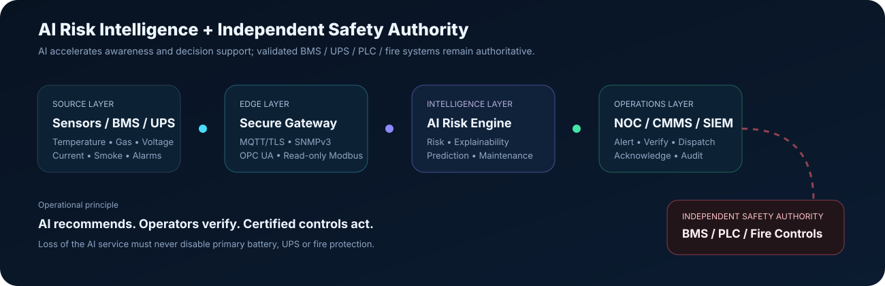
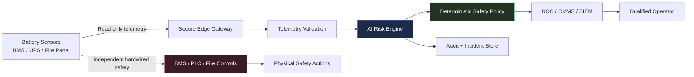
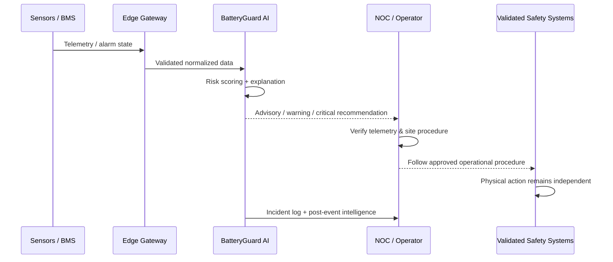

<div align="center">



# BatteryGuard AI
### AI-Powered Battery Safety Intelligence for Telecom & Mission-Critical Data Centers

**Predict. Prevent. Protect.**

[](https://raw.githack.com/hossain0707/ai-battery-safety-demo/77249ecf149ab6835813d403a2cfbb711e27185f/index.html)


**Production-oriented reference platform for AI-assisted stationary battery safety, designed around telecom/data-center operations in Bangladesh and a Grameenphone-aligned public reference context.**

</div>

> [!IMPORTANT]
> **Safety boundary:** BatteryGuard AI is an early-warning and operator decision-support layer. It is **not** a certified BMS, fire panel, PLC safety controller, protection relay, or emergency-shutdown system. Validated BMS/UPS/PLC/fire systems and approved site procedures remain authoritative.

---

## Live Client / Investor Demo

<div align="center">

### [▶ Launch the Interactive BatteryGuard AI Demo](https://raw.githack.com/hossain0707/ai-battery-safety-demo/77249ecf149ab6835813d403a2cfbb711e27185f/index.html)

**Executive / Investor View · Engineering / NOC View · Digital Twin · Explainable AI · Incident Story Mode**

</div>

| Demo experience | What it communicates |
|---|---|
| **Executive / Investor View** | Business value, operational exposure, uptime protection, predictive-maintenance opportunity |
| **NOC / Engineering View** | Telemetry, AI factors, rack risk, safety state, incidents, architecture |
| **Guided Story Mode** | How a weak precursor evolves into an actionable incident |
| **Digital Twin** | Visual battery-room and rack-level condition awareness |
| **Bangladesh Fleet View** | Illustrative multi-site telecom/data-center deployment concept |
| **Explainable AI** | Why the risk score changed and which sensor signals contributed |
| **Incident Report** | Simulated event intelligence suitable for review and audit workflows |

> [!NOTE]
> Demo site counts, financial values, lead times, incident outcomes, and telemetry are **simulated/illustrative** unless explicitly stated otherwise. The demo is not connected to live Grameenphone infrastructure and is not an official Grameenphone product.

---

## Product Vision

BatteryGuard AI adds an intelligence layer **above existing battery, UPS, environmental, and fire monitoring**. Instead of waiting only for a fixed threshold to be exceeded, it correlates multiple weak signals to help identify developing risk earlier.

**Battery begins behaving abnormally → AI correlates weak signals → risk becomes explainable → operator is alerted earlier → validated site procedures respond before the incident becomes an outage.**

---

## Why This Matters

| Traditional challenge | BatteryGuard AI approach | Intended operational value |
|---|---|---|
| Threshold alarms react after a parameter crosses a limit | Multi-sensor precursor analysis | Earlier awareness |
| Operators inspect many independent signals | Unified explainable risk score | Faster triage |
| Battery health is reviewed periodically | Continuous health and degradation indicators | Predictive maintenance |
| Events are fragmented across systems | Incident timeline + audit record | Better post-event analysis |
| Multi-site fleets are difficult to prioritize | Fleet-level risk ranking | Smarter maintenance allocation |
| Black-box AI can reduce trust | Factor-level explanations | Operator confidence |
| AI failure could create unsafe dependency | Advisory-first architecture | Primary protection remains independent |

---

## AI Risk Intelligence



| Signal / feature | Why it matters | Example AI use |
|---|---|---|
| **Maximum cell temperature** | Direct thermal-stress indicator | Thermal risk scoring |
| **Temperature spread** | Identifies uneven module/cell behavior | Localized anomaly detection |
| **Temperature rise rate** | Helps detect rapidly worsening conditions | Early-warning precursor |
| **Hydrogen (H₂)** | Relevant to ventilation / VRLA / off-gas risk | Gas accumulation detection |
| **Carbon monoxide (CO)** | Additional abnormal-event evidence | Multi-sensor confirmation |
| **Pack voltage deviation** | Highlights imbalance / abnormal electrical behavior | Degradation and fault detection |
| **Internal resistance** | Useful battery-health indicator | Predictive maintenance |
| **Smoke / BMS alarm** | Authoritative upstream evidence | Immediate critical escalation |

---

## Six Investor-Friendly Demo Scenarios

| Scenario | Primary signals | AI story | Example outcome |
|---|---|---|---|
| 🔥 **Thermal Runaway Precursor** | Temp rate, gas, voltage spread | Weak signals correlate before hard threshold | Early warning + intervention |
| 💨 **Hydrogen Rise** | H₂, ventilation trend | Gradual gas buildup is identified | Inspection before unsafe accumulation |
| ⚡ **Cell Imbalance** | Voltage, resistance, spread | Persistent degradation pattern | Predictive maintenance |
| ❄️ **Cooling Failure** | Ambient + rack thermal correlation | Systemic issue vs one bad rack | Facility response |
| 🚨 **BMS Alarm** | Authoritative BMS input | Critical workflow is forced | Immediate NOC escalation |
| 📡 **Sensor Failure** | Freshness / consistency | Instrument integrity problem identified | Maintenance before blind monitoring |

---

## Safety State Model

| State | Typical meaning | Platform behavior | Physical control authority |
|---|---|---|---|
| 🟢 **NORMAL** | Telemetry within expected analytics envelope | Continue monitoring | External validated systems |
| 🟡 **ADVISORY** | Early anomaly / degradation | Increase observation | External validated systems |
| 🟠 **WARNING** | Correlated evidence requires verification | Operator / maintenance escalation | External validated systems |
| 🔴 **CRITICAL** | Strong AI evidence or smoke/BMS alarm | Emergency-procedure recommendation | **BMS / UPS / PLC / fire systems only** |

Every API risk assessment returns `control_permitted = false`. That is intentional.

---

## Production Architecture



| Integration | Recommended posture |
|---|---|
| **MQTT** | TLS + authenticated device/gateway identity |
| **SNMP** | SNMPv3 |
| **OPC UA** | Secure, authenticated read path |
| **Modbus TCP** | Prefer read-only gateway integration |
| **BMS / UPS APIs** | Vendor-approved, least-privilege access |
| **Fire systems** | Monitoring only unless separately engineered/certified |

---

## Incident Workflow



---

## Platform Capabilities

| Capability | Status | Notes |
|---|---:|---|
| FastAPI telemetry service | ✅ | Strict schema and range validation |
| LFP / NMC / VRLA profiles | ✅ | Chemistry-aware reference profiles |
| Multi-sensor risk fusion | ✅ | Transparent factor-level scoring |
| Smoke / BMS forced escalation | ✅ | Deterministic critical behavior |
| Incident persistence | ✅ | SQLite pilot store |
| Operator acknowledgement | ✅ | Auditable workflow |
| API-key write protection | ✅ | Pilot security control |
| Docker deployment | ✅ | Container-ready |
| GitHub Actions CI | ✅ | Automated tests + build |
| Client/investor dashboard | ✅ | Premium interactive demo |
| Real BMS / UPS connector | 🔜 | Requires target-site protocol details |
| Historical ML calibration | 🔜 | Requires sanitized operational history |
| Multi-site production DB | 🔜 | PostgreSQL / time-series recommended |
| Production SSO / RBAC | 🔜 | Enterprise identity integration |
| Certified safety integration | ⚠️ | Independent engineering/certification required |

---

## API Surface

| Endpoint | Method | Purpose |
|---|---:|---|
| `/healthz` | GET | Service liveness |
| `/readyz` | GET | Readiness and safety mode |
| `/api/v1/config` | GET | Supported chemistry / configuration |
| `/api/v1/telemetry` | POST | Ingest telemetry + risk assessment |
| `/api/v1/status` | GET | Latest rack / fleet status |
| `/api/v1/incidents` | GET | Incident history |
| `/api/v1/incidents/{id}/ack` | POST | Operator acknowledgement |

---

## Technology Stack

| Layer | Technology |
|---|---|
| **API / services** | Python 3.12, FastAPI, Pydantic |
| **Risk logic** | Chemistry-aware transparent risk fusion |
| **Pilot persistence** | SQLite |
| **Production DB recommendation** | PostgreSQL / TimescaleDB |
| **Frontend demo** | HTML, CSS, JavaScript, SVG |
| **Deployment** | Docker, Docker Compose |
| **CI** | GitHub Actions |
| **Operations** | NOC, CMMS, SIEM |
| **Protocols** | MQTT/TLS, SNMPv3, OPC UA, read-only Modbus TCP |

---

## Run Locally

```bash
cp .env.example .env
# Replace BATTERY_SAFETY_API_KEY with a long random secret
docker compose up --build
```

Dashboard: `http://localhost:8080` · API docs: `http://localhost:8080/docs` · Health: `http://localhost:8080/healthz`

---

## Bangladesh / Grameenphone-Aligned Reference Context

This repository is structured for a **Bangladesh telecom/data-center reference use case** and publicly described Grameenphone infrastructure context. It assumes mission-critical uptime, mixed lithium/VRLA fleets, existing BMS/UPS/fire protection, NOC-driven incident handling, and strong auditability.

> [!CAUTION]
> This repository is **not an official Grameenphone system**, contains no confidential Grameenphone design information, and does not imply endorsement, partnership, certification, or deployment by Grameenphone.

---

## Standards / Engineering Reference Set

| Reference | Relevance |
|---|---|
| **IEC 62619** | Industrial lithium battery safety, including telecom / UPS contexts |
| **IEC 63056** | Stationary battery requirements for energy-storage applications |
| **UL 9540A** | Thermal-runaway fire propagation test methodology |
| **NFPA 855** | Stationary energy-storage installation / fire protection reference |
| **IEEE 1188-2025** | VRLA maintenance, testing, and replacement practices |
| **Bangladesh building / fire requirements** | Local deployment and authority review |

**Referencing a standard is not a claim of certification or compliance.**

---

## Path to a Real Telecom / Data-Center Pilot

| Phase | Goal | Deliverable |
|---|---|---|
| **1. Discovery** | Map battery/BMS/UPS/fire/NOC environment | Sanitized telemetry dictionary |
| **2. Read-only integration** | Connect operational data safely | Edge gateway + telemetry pipeline |
| **3. Historical calibration** | Tune analytics to fleet behavior | Validated risk baselines |
| **4. Shadow mode** | Compare AI alerts vs real operations | Precision / recall / lead-time evidence |
| **5. Site acceptance** | Validate cyber/electrical/fire/operations | Pilot acceptance report |
| **6. NOC integration** | Connect approved workflow | CMMS / SIEM / NOC escalation |
| **7. Scale-out** | Extend to more sites and battery families | Production fleet platform |

---

## Current Validation

Automated tests cover nominal behavior, multi-sensor escalation, smoke-forced critical state, temperature-rate features, API health, telemetry ingestion/status, plus Docker build through CI.

---

## Documentation

| Document | Purpose |
|---|---|
| [Production Architecture](docs/ARCHITECTURE.md) | Safety boundary and services |
| [Safety Case](docs/SAFETY_CASE.md) | Intended use, hazards and controls |
| [Deployment Guide](docs/DEPLOYMENT.md) | Pilot / production path |
| [Security Policy](SECURITY.md) | Security expectations |
| [Proprietary License](LICENSE) | Ownership and permitted use |

---

## Ownership & License

**Copyright © 2026 MD Najmul Hossain (GitHub: [hossain0707](https://github.com/hossain0707)). All Rights Reserved.**

This repository is **publicly viewable but not open-source**. The original code, documentation, visual assets, product concept, demo materials, and project materials are distributed under the repository's **Proprietary License**. Evaluation is allowed for prospective clients, investors, collaborators, and partners, but copying, redistribution, commercial use, derivative commercial products, or deployment requires prior written permission.

See the full [LICENSE](LICENSE).

---

<div align="center">

### BatteryGuard AI
**AI intelligence for safer, more resilient mission-critical battery infrastructure.**

[Launch Demo](https://raw.githack.com/hossain0707/ai-battery-safety-demo/77249ecf149ab6835813d403a2cfbb711e27185f/index.html) · [Architecture](docs/ARCHITECTURE.md) · [Safety Case](docs/SAFETY_CASE.md) · [License](LICENSE)

<sub>Engineering reference / pilot foundation · Advisory-first safety architecture · No certification claimed</sub>

</div>